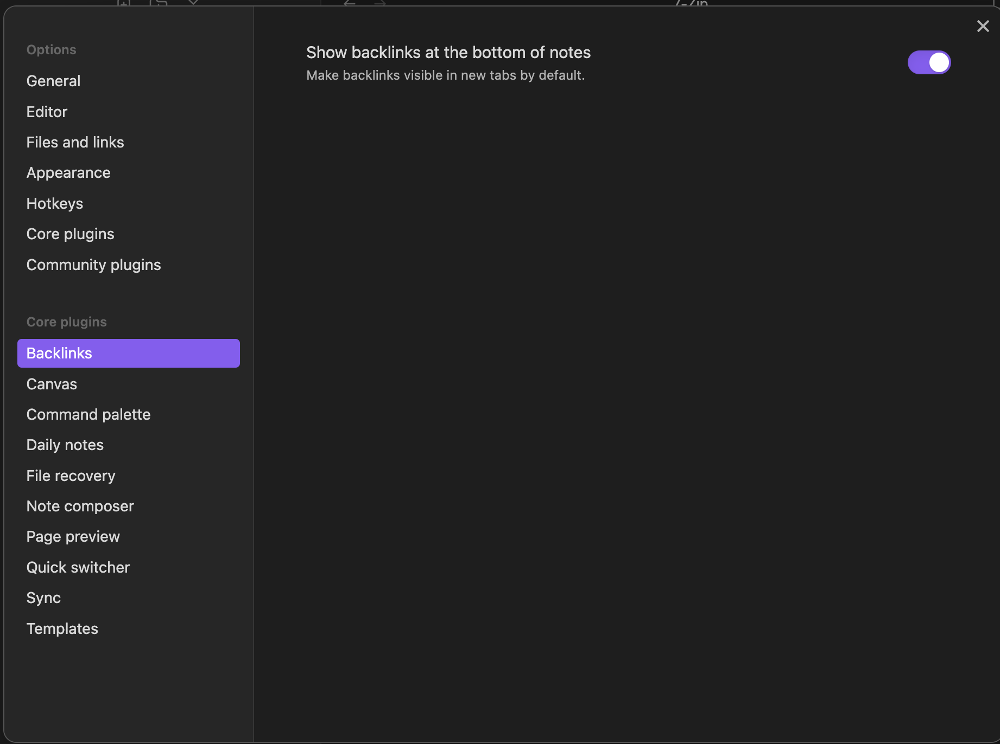
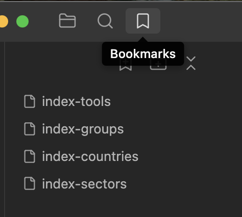

# Threat Intelligence JSON to Obsidian Converter


This project provides a simple and effective way to convert threat intelligence data, sourced from ETDA Thailand, into a structured and interlinked Obsidian vault. It uses Python and Docker to process JSON files into individual Markdown notes, complete with metadata and links, perfect for threat intelligence research and analysis.

## Data Source

This project utilizes publicly available threat intelligence data, which is scraped from the following endpoints provided by the Electronic Transactions Development Agency (ETDA) of Thailand:

-   **Threat Groups:** `https://apt.etda.or.th/cgi-bin/listgroups.cgi`
-   **Threat Tools:** `https://apt.etda.or.th/cgi-bin/listtools.cgi`


## Purpose

The primary goal of this script is to create a rich, navigable knowledge base within **Obsidian.md**. By converting each threat group, tool, country, and sector into its own note, and by automatically generating links between them, it builds a powerful graph database for exploring relationships in threat intelligence data.

## Obsidian Setup

To get the most out of your new threat intelligence vault, a little setup in Obsidian is recommended.

### 1. Enable Backlinks

It is highly recommended to enable the **Backlinks** core plugin. This will show you all the pages that link *to* your current page, which is essential for discovering relationships.

You can find this in `Settings > Core Plugins > Backlinks`.



### 2. Check the Index Files

After running the script, your `output` folder will contain several `index-` files. These are your main entry points into the data:

-   `index-groups.md`
-   `index-tools.md`
-   `index-countries.md`
-   `index-sectors.md`

### 3. Bookmark Your Indexes

For easy access, you should add these index files to your Obsidian bookmarks. This will keep them pinned to the side for quick navigation.




## How to Refresh Your Data

As the threat landscape changes, you can refresh your vault with the latest data.

1.  Replace the JSON files in the `inputs/` directory with the newly downloaded ones.
2.  Run the following command from your project's root directory in your terminal:

    ```bash
    docker-compose up --build
    ```

This will rebuild the Docker container and run the Python script, updating all the markdown files in your `output/` directory with the latest information.


This 

```
docker-compose up --build
```
